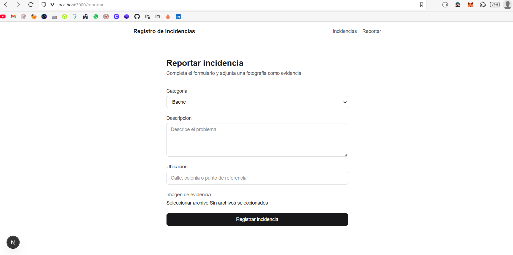
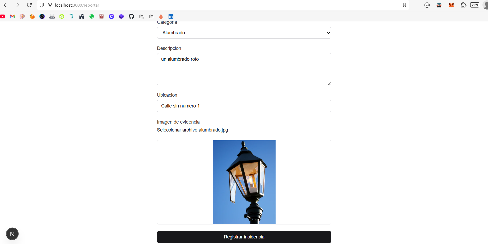
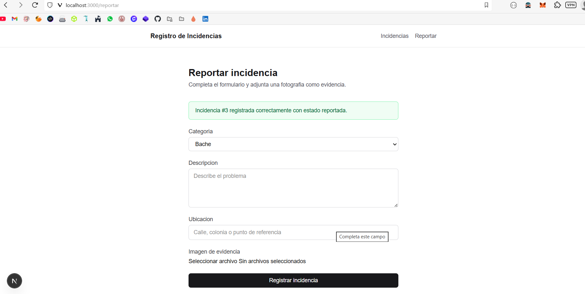
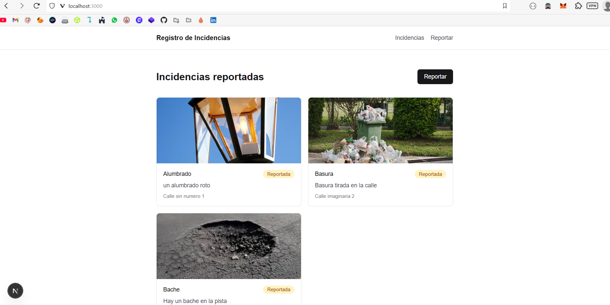
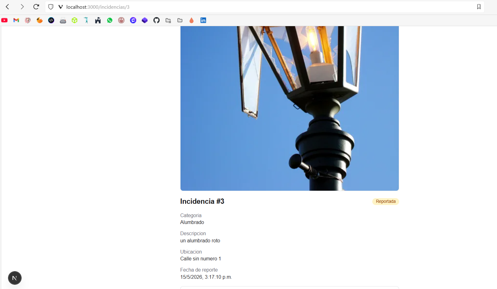
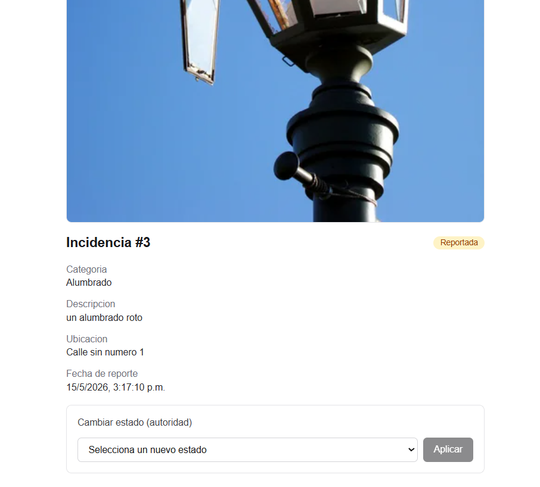
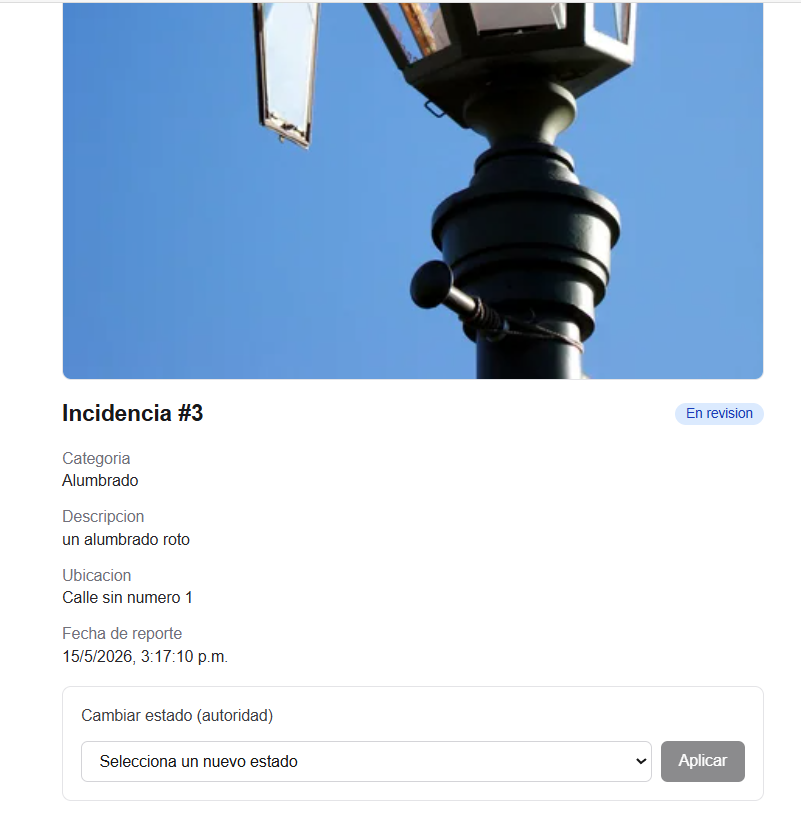
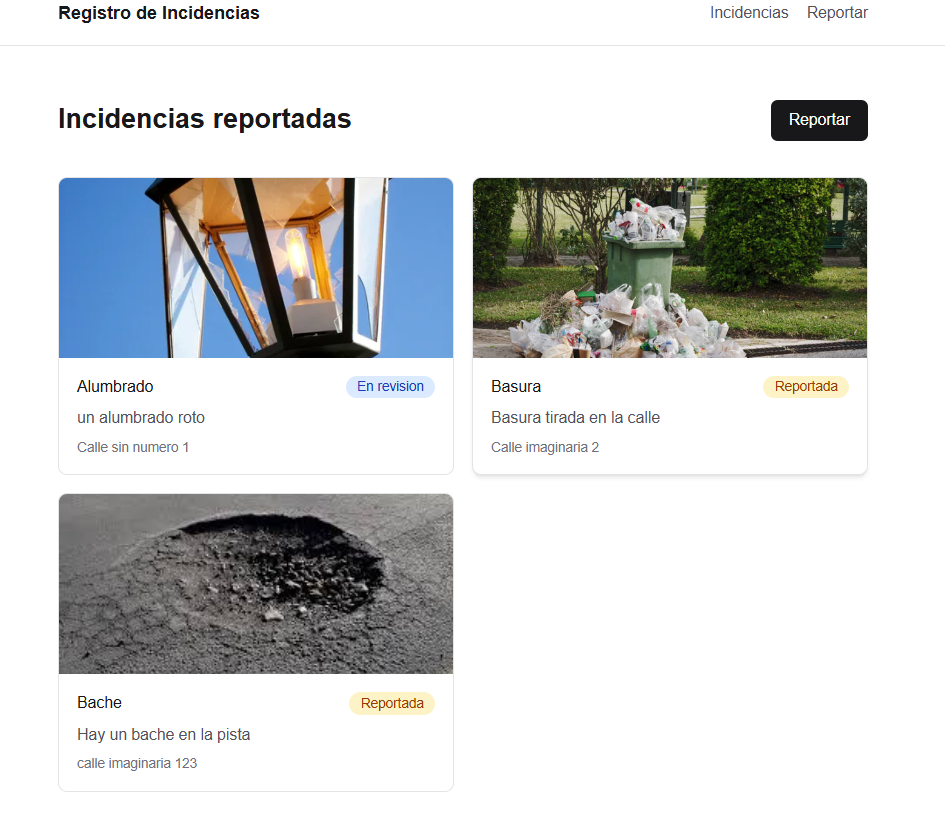

# Evidencias — Sistema de Registro de Incidencias

Registro visual del funcionamiento de los tres casos de uso. Las imágenes se
colocan en la carpeta `evidencias/`.

**Actores:** ciudadano (reporta y consulta) y autoridad (da seguimiento).
**Stack:** FastAPI + SQLite (backend) y Next.js (frontend).

---

## CU-01 — Registrar una incidencia con evidencia fotográfica

**Historia:** como ciudadano quiero reportar una incidencia adjuntando una
foto, categoría, descripción y ubicación, para que la autoridad pueda atenderla.

**Flujo principal**

1. El ciudadano abre el formulario en `/reportar`.
2. Elige categoría, escribe descripción y ubicación.
3. Selecciona una imagen y ve la vista previa.
4. Envía; el sistema valida y guarda la imagen, y registra la incidencia con
   estado `reportada`.
5. Se muestra la confirmación con el folio generado.

**Flujos alternativos**

- Campos obligatorios vacíos: el formulario no se envía.


**Evidencia**




---

## CU-02 — Consultar y visualizar incidencias

**Historia:** como ciudadano quiero ver las incidencias reportadas con su foto y
estado, para saber qué se ha notificado y en qué punto va su atención.

**Flujo principal**

1. El usuario abre el listado en `/`.
2. El sistema muestra cada incidencia con imagen, categoría, estado y fecha.
3. El usuario abre una incidencia para ver su detalle completo.

**Flujos alternativos**

- Sin incidencias: se muestra el mensaje "Aún no hay incidencias reportadas".
- Incidencia inexistente o backend sin respuesta: se muestra un mensaje de error.


**Evidencia**




---

## CU-03 — Actualizar el estado de una incidencia (workflow)

**Historia:** como autoridad quiero cambiar el estado de una incidencia conforme
avanza su atención, para dar trazabilidad del seguimiento.

**Flujo principal**

1. La autoridad abre el detalle de una incidencia.
2. El panel muestra solo las transiciones válidas desde el estado actual.
3. Selecciona el nuevo estado y aplica el cambio.
4. El sistema valida la transición y actualiza el estado.

**Flujos alternativos**

- Transición no permitida: se rechaza e informa los estados válidos.
- Estado final (`resuelta` / `rechazada`): el panel indica que no admite cambios.

**Workflow de estados**

```
reportada -> en_revision -> en_proceso -> resuelta
     |             |
     +-------------+--------------> rechazada
```


**Evidencia**




---

## Requisitos no funcionales relevantes

- API REST con respuestas JSON y documentación en `/docs`.
- CORS habilitado para el frontend.
- Imágenes en formatos JPG, PNG o WEBP, guardadas con nombre único.

